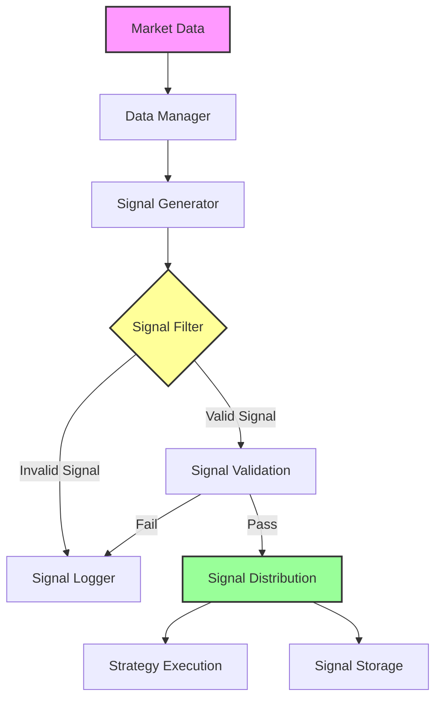

# AlgoHood Signal

Your Smart Assistant for Quantitative Trading Signals

## What is it?

AlgoHood Signal is your central command center for managing trading signals in quantitative trading. Think of it as a smart assistant that helps you:

- 🎯 Capture and generate trading signals
- 📊 Analyze signal performance
- 🔄 Process market data in real-time
- 📈 Evaluate trading strategies

## Signal Processing Flow



### Flow Description

1. **Data Ingestion**
   - Receive real-time market data
   - Data preprocessing and cleaning
   - Feature calculation and extraction

2. **Signal Generation**
   - Generate raw signals based on strategy rules
   - Apply technical indicators and models
   - Create trading recommendations

3. **Signal Filtering**
   - Risk control checks
   - Liquidity assessment
   - Signal strength validation

4. **Signal Distribution**
   - Multi-strategy distribution
   - Priority management
   - Real-time delivery

5. **Execution Feedback**
   - Execution status tracking
   - Performance evaluation
   - Strategy adjustment

## Why do you need it?

As a quantitative trader, you face these challenges daily:
- Managing multiple trading signals simultaneously
- Processing massive amounts of market data
- Evaluating the performance of each signal
- Ensuring your systems run efficiently

This is where AlgoHood Signal comes in! It automates these tasks, letting you focus on strategy development.

## Core Components

### 🎯 Signal Manager
- Automatically captures and processes trading signals
- Monitors the complete signal lifecycle
- Updates signal status in real-time

### 📊 Data Manager
- Handles real-time market data feeds
- Manages historical data efficiently
- Provides clean, processed data streams

### 📈 Performance Manager
- Analyzes signal performance metrics
- Evaluates strategy effectiveness
- Calculates key performance indicators

### 💻 Cluster Manager
- Handles distributed computing tasks
- Balances workload automatically
- Manages system resources efficiently

## Key Benefits

- ⚡ Lightning-fast: Millisecond-level signal processing
- 🔄 Scalable: Easily handle increasing data volumes
- 📊 Comprehensive: Deep performance analytics
- 🛠 Flexible: Customizable to your needs
- 📝 Reliable: Complete monitoring and logging

## Technical Architecture

The system consists of several key components:

### Engine Components
- **Signal Manager (`signalMgr.py`)**
  - Signal generation and processing
  - Signal lifecycle management
  - Real-time signal updates

- **Data Manager (`dataMgr.py`)**
  - Market data processing
  - Historical data management
  - Real-time data feeds

- **Performance Manager (`performanceMgr.py`)**
  - Signal performance analysis
  - Strategy evaluation
  - Performance metrics calculation

- **Cluster Manager (`clusterMgr.py`)**
  - Distributed computing management
  - Load balancing
  - Resource allocation

### Configuration
- **Redis Configuration (`redisConfig.py`)**
  - Redis connection settings
  - Cache management parameters

- **Logger Configuration (`loggerConfig.py`)**
  - Logging settings
  - Debug configurations

## Installation

```bash
pip install -e .
```

## Dependencies

The project relies on the AlgoHood Utils package and other dependencies that will be installed automatically during setup.

## Quick Start

```python
from algoSignal.algoEngine import signalMgr, dataMgr

# Initialize Signal Manager
signal_manager = signalMgr.SignalManager()

# Initialize Data Manager
data_manager = dataMgr.DataManager()

# Process signals
signal_manager.process_signals()
```

## Configuration

Configure the system by modifying the configuration files in the `algoConfig` directory:
- `redisConfig.py` for Redis settings
- `loggerConfig.py` for logging preferences

## Contributing

Please follow the project's coding standards and submit pull requests for any new features or bug fixes.

## License

Proprietary - All rights reserved

## Author

Jingyuan (jijingyuan@rookiequant.com)
