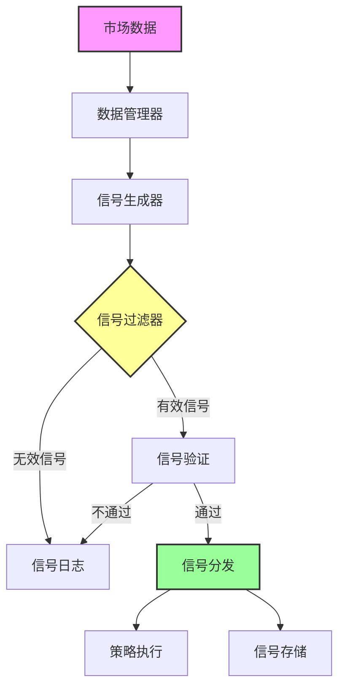

# AlgoHood Signal

您的量化交易信号管理助手

## 这是什么？

AlgoHood Signal 是您的量化交易信号管理指挥中心。它就像一个智能助手，帮助您：

- 🎯 捕捉和生成交易信号
- 📊 分析信号表现
- 🔄 实时处理市场数据
- 📈 评估交易策略

## 信号处理流程



### 流程说明

1. **数据接入**
   - 接收实时市场数据
   - 数据预处理和清洗
   - 特征计算和提取

2. **信号生成**
   - 根据策略规则生成原始信号
   - 应用技术指标和模型
   - 生成交易建议

3. **信号过滤**
   - 风险控制检查
   - 流动性评估
   - 信号强度验证

4. **信号分发**
   - 多策略分发
   - 优先级管理
   - 实时推送

5. **执行反馈**
   - 执行状态跟踪
   - 性能评估
   - 策略调整

## 为什么需要它？

作为量化交易员，您每天都面临这些挑战：
- 同时管理多个交易信号
- 处理海量市场数据
- 评估每个信号的表现
- 确保系统高效运行

这就是 AlgoHood Signal 发挥作用的地方！它自动化处理这些任务，让您可以专注于策略开发。

## 核心组件

### 🎯 信号管理器
- 自动捕捉和处理交易信号
- 监控完整的信号生命周期
- 实时更新信号状态

### 📊 数据管理器
- 处理实时市场数据流
- 高效管理历史数据
- 提供清洗后的数据流

### 📈 性能管理器
- 分析信号性能指标
- 评估策略有效性
- 计算关键性能指标

### 💻 集群管理器
- 处理分布式计算任务
- 自动负载均衡
- 高效管理系统资源

## 主要优势

- ⚡ 超高速度：毫秒级信号处理
- 🔄 高扩展性：轻松应对数据量增长
- 📊 全面分析：深度性能分析
- 🛠 灵活定制：根据需求自定义
- 📝 可靠监控：完整的监控和日志系统

## 技术架构

系统由以下关键组件组成：

### 引擎组件
- **信号管理器 (`signalMgr.py`)**
  - 信号生成和处理
  - 信号生命周期管理
  - 实时信号更新

- **数据管理器 (`dataMgr.py`)**
  - 市场数据处理
  - 历史数据管理
  - 实时数据馈送

- **性能管理器 (`performanceMgr.py`)**
  - 信号性能分析
  - 策略评估
  - 性能指标计算

- **集群管理器 (`clusterMgr.py`)**
  - 分布式计算管理
  - 负载均衡
  - 资源分配

### 配置模块
- **Redis配置 (`redisConfig.py`)**
  - Redis连接设置
  - 缓存管理参数

- **日志配置 (`loggerConfig.py`)**
  - 日志设置
  - 调试配置

## 安装

```bash
pip install -e .
```

## 依赖

本项目依赖于 AlgoHood Utils 包和其他依赖项，这些将在安装过程中自动安装。

## 快速开始

```python
from algoSignal.algoEngine import signalMgr, dataMgr

# 初始化信号管理器
signal_manager = signalMgr.SignalManager()

# 初始化数据管理器
data_manager = dataMgr.DataManager()

# 处理信号
signal_manager.process_signals()
```

## 配置说明

通过修改 `algoConfig` 目录中的配置文件来配置系统：
- `redisConfig.py` 用于 Redis 设置
- `loggerConfig.py` 用于日志首选项

## 参与贡献

请遵循项目的编码标准，并为任何新功能或错误修复提交拉取请求。

## 许可证

专有软件 - 保留所有权利

## 作者

Jingyuan (jijingyuan@rookiequant.com) 